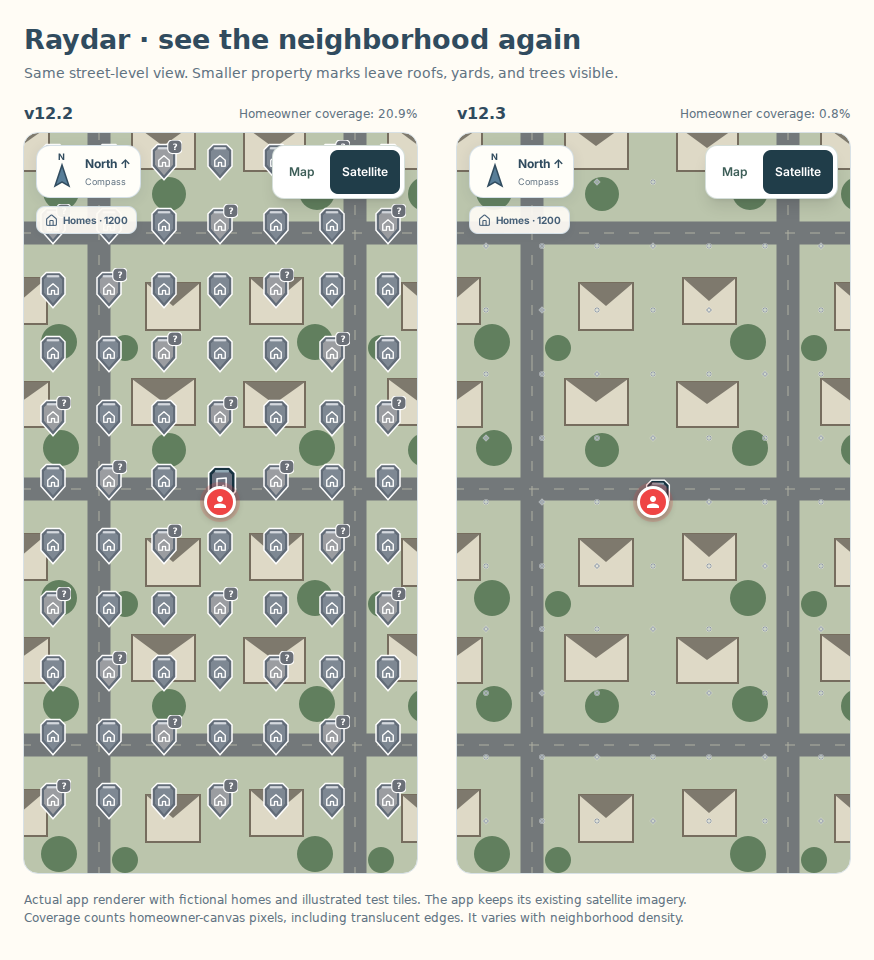

# Raydar v12.3 — clearer neighborhood maps

This release reduces map obstruction from homeowner and worked-lead pins. It retains satellite/street imagery and the existing homeowner names, occupancy estimates, lead outcomes, warm-lead Signal R badge, and device cache. It makes no changes to Firebase queries, rules, imported data, or backend services.

## Map sizing

The old homeowner layer reused the full worked-pin silhouette on every property. Dimensions below are the SVG image boxes in CSS pixels, not the invisible touch targets.

| View | Previous homeowner mark | New homeowner mark | Previous worked pin | New worked pin |
| --- | --- | --- | --- | --- |
| Neighborhood (zoom 15) | 34 × 40 | 6 × 6 | 34 × 40 | 18 × 21 |
| Street (zoom 17) | 36 × 42 | 7 × 7 | 36 × 42 | 24 × 28 |
| Roof (zoom 18+) | 30 × 35 | 8 × 8 | 30 × 35 | 20 × 23 |

Gray circles show owner records; gray diamonds show suspected renters. Both have light outlines and partly transparent centers. Tap for the name and occupancy estimate. The selected homeowner alone grows to 16 × 16 with a cyan ring. Names remain in details rather than covering the imagery.

Worked pins keep a 44 × 44 touch target. Property marks use nearest-home selection within 24 pixels. A worked marker's transparent padding now yields to a closer homeowner mark, while a direct hit on the worked image selects that lead. Keyboard Enter/Space opens the focused worked lead's details. Muted historical pins are also smaller. No records are moved, edited, removed, or filtered by this display change.

## Install on the Mac mini

```bash
curl -fL "https://github.com/HappySolarCoder/happy-solar-leads/archive/refs/heads/codex/raydar-mobile-redesign-v12.3.zip" -o "$HOME/Downloads/raydar-v12.3.zip" &&
ditto -x -k "$HOME/Downloads/raydar-v12.3.zip" "$HOME/Downloads" &&
cd "$HOME/Downloads/happy-solar-leads-codex-raydar-mobile-redesign-v12.3" &&
bash scripts/mobile/install-android.sh
```

The installer reuses your earlier `.env.local` from Downloads. In Android Studio select the connected Galaxy S25 and click Run. Install over the existing app to retain local data. This archive contains source, not an APK. Android/iOS build number is 123 and version is 12.3.

## Firebase and the web app

This pin-sizing update adds no Firebase reads or writes. Existing nearby queries, caps, and cached-area reuse are unchanged. New areas can still incur the existing reads. No production Vercel deployment or live Firebase rules change was performed.

If the homeowner layer is still blocked, your Firebase bot should apply the additive homeowner-access rule described in [HOMEOWNERS-V12.md](HOMEOWNERS-V12.md), preserving the current live rules. That activation is separate from pin sizing; do not deploy an old entire rules file from this archive. The source release remains on its separate mobile branch. Do not merge this mobile branch into the production web branch.

## Verification

The density comparison uses the actual app renderer with fictional homes and illustrated test tiles, not real homeowner locations or satellite images. Screenshots use the same 393 × 740 map area at device pixel ratio 2. The comparison is a measure of pixels touched by the homeowner canvas, including translucent edges; it is not a live-device performance benchmark.

| View | Previous homeowner coverage | v12.3 homeowner coverage |
| --- | --- | --- |
| Neighborhood (zoom 15) | 67.02% | 6.36% |
| Street (zoom 17) | 20.89% | 0.76% |
| Roof (zoom 18) | 2.71% | 0.18% |



Verification includes the 70 existing mobile/server tests, TypeScript via a successful static export, focused homeowner/artwork lint, and browser checks for direct worked-pin selection, small-home taps, expanded touch areas, close neighboring pins, keyboard selection, zoom-out hiding, and narrow/landscape widths. Cache/list/details regression checks use fictional data and block remote APIs. No live customer records are modified.

Actual Galaxy S25 frame rate, outdoor visibility, production Firebase access, and live imported coordinate accuracy still need a device check. Keep the existing app installed and test a dense Buffalo/Rochester block in satellite view after updating.

Reproduce the isolated browser checks:

```bash
node scripts/mobile/check-export.mjs --audit
node scripts/mobile/check-pin-density-v123.mjs
MOBILE_EXPORT_DIR=/tmp/raydar-ui-audit-out node scripts/mobile/check-homeowners-v12.mjs
```

The scripts use `/tmp/raydar-browser/chromium` for the test browser. The synthetic export contains fictional authentication/data and must not be installed as the configured mobile app; the installation command above runs the real build script.
